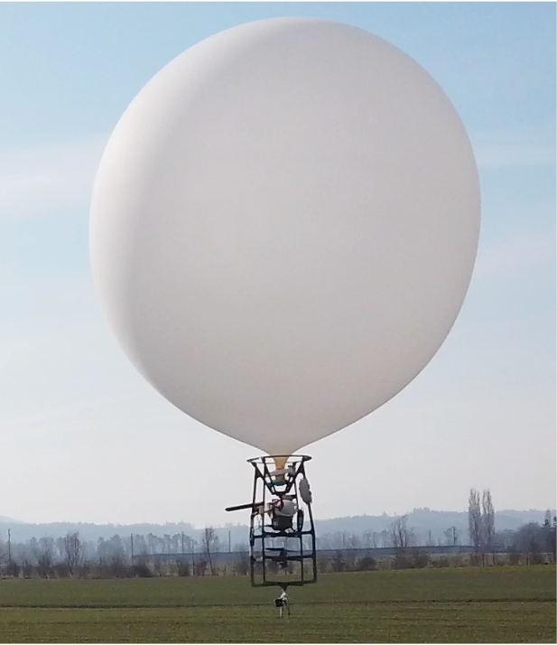
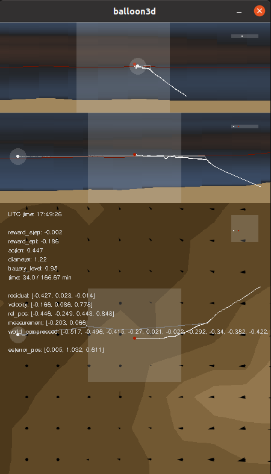

# Project Balloon (February 2021 - April 2022)

This project is part of a semester- and master-thesis with the goal to get a balloon from a starting point to a pre-defined target point in 3D-space.<br />
<p align="center">

</p>


## Installation
### Create a new conda environment
```
cd project_balloon
conda create --name balloon --file requirements.txt
conda activate balloon
conda install pip
pip install descartes==1.1.0
pip install gym==0.22.0
```
Get [torch](https://pytorch.org/get-started/locally/) depending on your hardware

## Getting started
## Folder structure
- arduino
    - Was used to control the indoor prototype during the tests in London
- python3
    - Contains everything regarding learning
```
cd python3
```

## Training (requires downloading a training set)
Uncomment the line ```import agent_train``` in setup.py.<br />
It's recommended to generate multiple config files (see generate_yaml.py) and train in parallel.
```
python3 setup.py yaml/config_train.yaml
```

## Testing with pretrained model
The data provided in the data_example folder is a collection of eleven wind maps used during real life flight tests.<br />
```
python3 setup.py yaml/config_test.yaml
```

## Visualization
Can be turned on or off in config_NNNNN.py through the parameter ```render```.
- Top window: x-plane (side view)
- Middle window: y-plane (side view)
- Bottom window: z-plane (top-down view)
- White point: Target with acceptance radius
- Red point: balloon
- Red line: current action predicted by algorithm
- White line: path taken by balloon
- Grey line: random roll out used to set reachable target
- Orange background: wind blowing from left to right
- Blue background: wind blowing from right to left
<br/><br/>
<p align="center">

</p>

## Downloading training data (requires meteomatics credentials)
Due to licencing reasons we can not put up all the data used to train and test the algorithm.<br />
Our training set consists of 1000 wind maps, our testing set of 300 wind maps. Each map consists of 24 files, one for each hour of the day.<br />
To download your own, get a [meteomatics](https://www.meteomatics.com) licence.
```
cd meteomatics
python3 convert_meteomatics.py ../yaml/config_train.yaml
python3 build_set.py ../yaml/config_train.yaml
```

## Important files
### generate_yaml.py
This generates yaml files (config_NNNNN.py) that are needed for training and testing. All the important parameters can be set there.<br />
Multiple files are generated to allow training in parallel (e.g. on a cluster). If you're running this on a standard computer we suggest only training with one yaml file at the same time.<br />
If you are using a cluster, adapt and use the generated submit.txt file to submit jobs easier.

### meteomatics/convert_meteomatics.py ../yaml/config_NNNNN.py
This downloads either a big set of data (big_file = True) that then needs to be converted into a set using build_set.py or generates a dataset of wind data on the current day (big_file = False).

### generate_noise.py
This generates noise files (folder noise_MAPSIZE_XxMAPSIZE_Y) that are needed for training and testing.

### setup.py yaml/config_NNNNN.py
This generates the folder structure and trains the algorithm with a short testing at the end.

### agent_test.py yaml/config_NNNNN.py
This tests the trained weights.